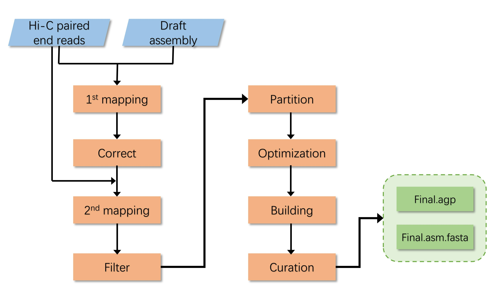
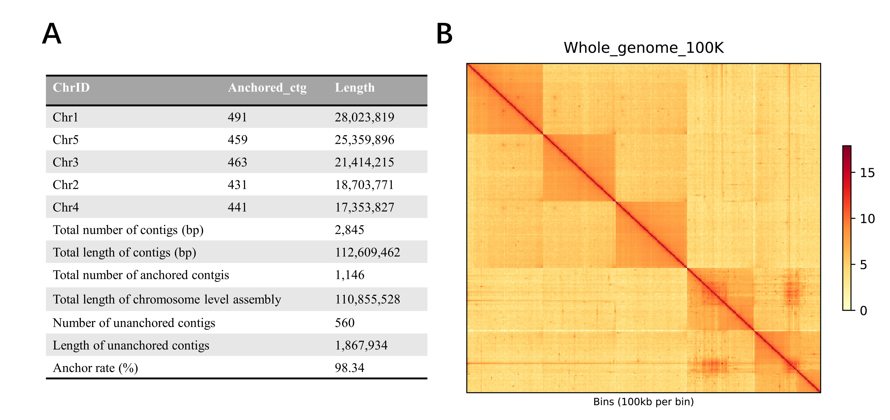

[](http://www.gnu.org/licenses/gpl-3.0)

# Chromosome scaffolding of simple diploid genomes using ALLHiC
High-throughput chromosome conformation capture (Hi-C) technology has become an economical and robust tool to generate a chromosome-scale assembly. However, high-quality chromosome scaffoldings are limited by the short contigs and chimeric contigs, making the assembly quality unsatisfactory. Here we present a Hi-C scaffolding protocol based on ALLHiC, which integrates multiple functions to break chimeric contigs and generate chromosome-scale scaffolds. In addition, we describe a convenient way to curate the remaining mis-assemblies. This pipeline has been successfully applied on many genome projects, including our previously published banyan tree and oolong tea genomes.  
## Overview of the workflow


## Installation
- Running environment:
    - The major workflow was constructed based on the Linux system.
    - The juicebox is recommended to run on the Windows/MacOS. 
- Required software
    - [Miniconda](https://repo.anaconda.com/miniconda)
    - [bwa](https://github.com/lh3/bwa) 
    - [samtools (version 1.9)](http://www.htslib.org/)
    - [bedtools](https://github.com/arq5x/bedtools2)
    - [ALLHiC](https://github.com/tangerzhang/ALLHiC)
    - [asmkit](https://github.com/wangyibin/asmkit)
    - [ParaFly](http://parafly.sourceforge.net)
    - [3D-DNA](https://github.com/aidenlab/3d-dna)
    - [juicebox_scripts](https://github.com/phasegenomics/juicebox_scripts)
    - [Perl 5](https://www.perl.org/)
    - [Python 3](https://www.python.org/)
    - [Matplotlib](https://matplotlib.org)
    - [Pandas](https://pandas.pydata.org)
    - [Numpy](https://www.numpy.org)
- Installation
    1.	Install the conda package manager
        ```bash
        curl -O https://repo.anaconda.com/miniconda/Miniconda3-latest-Linux-x86_64.sh
        sh Miniconda3-latest-Linux-x86_64.sh
        ```
    2.	Install the bwa, samtools, bedtools, and Perl via conda.
        ```bash
        conda install -c bioconda bwa samtools bedtools
        conda install -c conda-forge Perl
        ```
    3.	Install the python package of matplotlib, NumPy, and pandas via conda.
        ```bash
         conda install matplotlib numpy pandas
         ```
    4.	Install the ALLHiC, 3D-DNA, juicebox_scripts via Github. We recommend installing these packages into `~/software`.  
        a. ALLHiC
        ```bash
        git clone https://github.com/tangerzhang/ALLHiC.git
        chmod -R 755 ALLHiC
        echo “export PATH=$HOME/software/ALLHiC/bin:$HOME/software/ALLHiC/scripts:$PATH” >> ~/.bash_profile
        ```
        b. 3D-DNA
        ```bash
        git clone https://github.com/aidenlab/3d-dna.git 
        ```
        c. juicebox_scripts 
        ```bash
        git clone https://github.com/phasegenomics/juicebox_scripts.git
        ```
    5.	Install the `asmkit` and `ParaFly`.  
        a.	asmkit 
        ```bash
        wget https://github.com/wangyibin/asmkit/releases/download/v0.0.1/asmkit
        mv asmkit ~/bin
        ```
        b.	ParaFly
        ```bash
        wget https://sourceforge.net/projects/parafly/files/parafly-r2013-01-21.tgz
        tar xzvf parafly-r2013-01-21.tgz
        cd parafly-r2013-01-21
        ./configure –prefix=`pwd`
        make install
        mv bin/ParaFly ~/bin
        ```

## Input Data
This pipeline require *de novo* assembly and Hi-C data. 
- *de novo* assembly
- Hi-C data
And, a small testing data sets could download from [google drive sharing](https://drive.google.com/file/d/1oE6HpOTZ6rFSlVLOjO0EpIH_-cULCWec/view?usp=sharing). 
    ```
    Bio-protocol_2204520_data
    ├── draft.asm.fasta
    ├── Lib_R1.fastq.gz
    ├── Lib_R2.fastq.gz
    └── ref.chr.fasta
    ```

## Major steps
### Step 1: Correction of the draft contigs [Optional]
- Map Hi-C reads to the draft assembly. 
    a.	Prepare the genome alignment index of draft assembly. 
    
    ```bash
    bwa index draft.asm.fasta
    samtools faidx draft.asm.fasta
    ```
    b.	Map the Hi-C reads into draft assembly, meanwhile retain primary alignments, and sort the alignments. 
    ```bash
    bwa mem -5SPM -t 10 draft.asm.fasta Lib_R1.fastq.gz Lib_R2.fastq.gz \
                            | samtools view -hF 256 - \
                        | samtools sort -@ 10 -o sorted.bam -T tmp.ali
    ```
- Create the index files of the above-sorted alignment file using samtools and break the misjoined contigs by Hi-C signals. 
    ```bash
    samtools index -@ 10 sorted.bam
    ALLHiC_corrector -m sorted.bam -r draft.asm.fasta -o seq.HiCcorrected.fasta -t 10
    ```

### Step 2: Map Hi-C reads to corrected assembly and filter Hi-C signals.  
- Mapping.  
    ```bash
    bwa index seq.HiCcorrected.fasta 
    bwa mem -5SPM -t 10 seq.HiCcorrected.fasta Lib_R1.fastq.gz Lib_R2.fastq.gz \
                | samtools view -hF 256 - \
                | samtools sort -@ 10 -o sample.bwa_mem.bam -T tmp.ali
    ```
- Filter the alignments. 
    ```bash
    samtools view -bq 30 sample.bwa_mem.bam > sample.unique.bam 
    PreprocessSAMs.pl sample.unique.bam seq.HiCcorrected.fasta HINDIII
    ```


#### Step 3: Partion
```bash
ALLHiC_partition -r seq.HiCcorrected.fasta -e enzyme_site (e.g. HindIII: AAGCTT; MboI: GATC) -k group_count -b sample.unique.REduced.paired_only.bam
```
#### Step 4: Optimization
```bash
for i in {1..k}
do 
    echo “allhic optimize sample.unique.REduced.paired_only.${k}g${i}.counts_RE.txt sample.unique.Reduced.paired_only.clm”; 
done > cmd.list

ParaFly -c cmd.list -CPU 4
```
#### Step 5: Building
```bash
ALLHiC_build seq.HiCcorrected.fasta
```
#### Step 6: Curation
- Create a hic format file which can import into the juicebox
    ```bash
    asmkit bam2links sample.bwa_mem.Reduced.paired_only.bam out.links
    asmkit agp2assembly groups.agp groups.assembly
    bash ~/software/3d-dna/visualize/run-assembly-visualizer.sh groups.assembly out.links
    ```

- Juicebox (https://github.com/aidenlab/Juicebox/wiki) is a graphical software that can be run in local machines (Windows or macOS), which can use to curate the mis-assemblies by Hi-C signals. After careful curation, a modified assembly can be exported.
- Convert modified assembly into agp location file and create the final chromosome-scale assembly.
    ```bash
    python ~/software/juicebox_scripts/juicebox_scripts/juicebox_assembly_converter.py -a groups.review.assembly -f seq.HiCcorrected.fasta -s
    ```

#### Step 7: Assessment of the final assembly
- Statistics of the chromosome length and anchoring rate.  
    ```bash
    statAGP.pl groups.review.agp
    ```
- Plot the heatmap of whole genome and per chromosome.  
    a. Get group length.
    ```bash
    samtools faidx groups.review.fasta 
    cut -f 1,2 groups.review.fasta.fai > len.txt
    ```
    b. Only keep chromosomal level assembly for plotting. 
    ```bash
    grep Chr len.txt > chrn.list
    ```
    c. Plot heatmap in 500-kb resolution and output in pdf format.
    ```bash
    ALLHiC_plot sample.bwa_mem.bam groups.review.agp chrn.list 500k pdf
    ```
    

## Expected results
- The expected results of this workflow are `groups.review.agp` and `groups.review.fasta`.

## License
It is a free and open source software, licensed under [GPLv3](https://github.com/github/choosealicense.com/blob/gh-pages/_licenses/gpl-3.0.txt).
